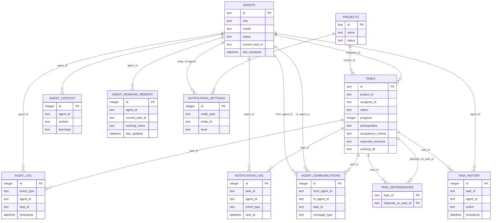
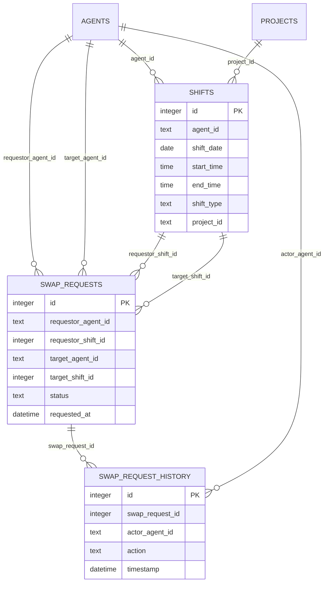
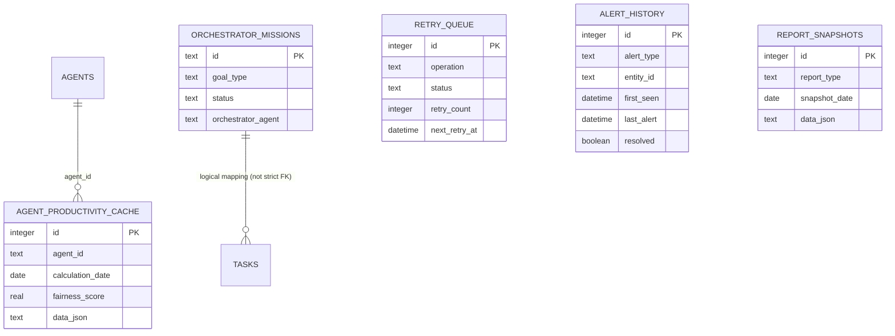

# AI Team System ERD

> อ้างอิงจาก `team.db` ปัจจุบัน (logical relationships)
> หมายเหตุ: ตารางส่วนใหญ่ไม่ได้ประกาศ `FOREIGN KEY` constraint แบบบังคับใน SQLite แต่มีความสัมพันธ์เชิงตรรกะตามคอลัมน์อ้างอิง

## 1) Core Workflow ERD

## 2) Scheduling & Swap ERD

## 3) Operational Tables

