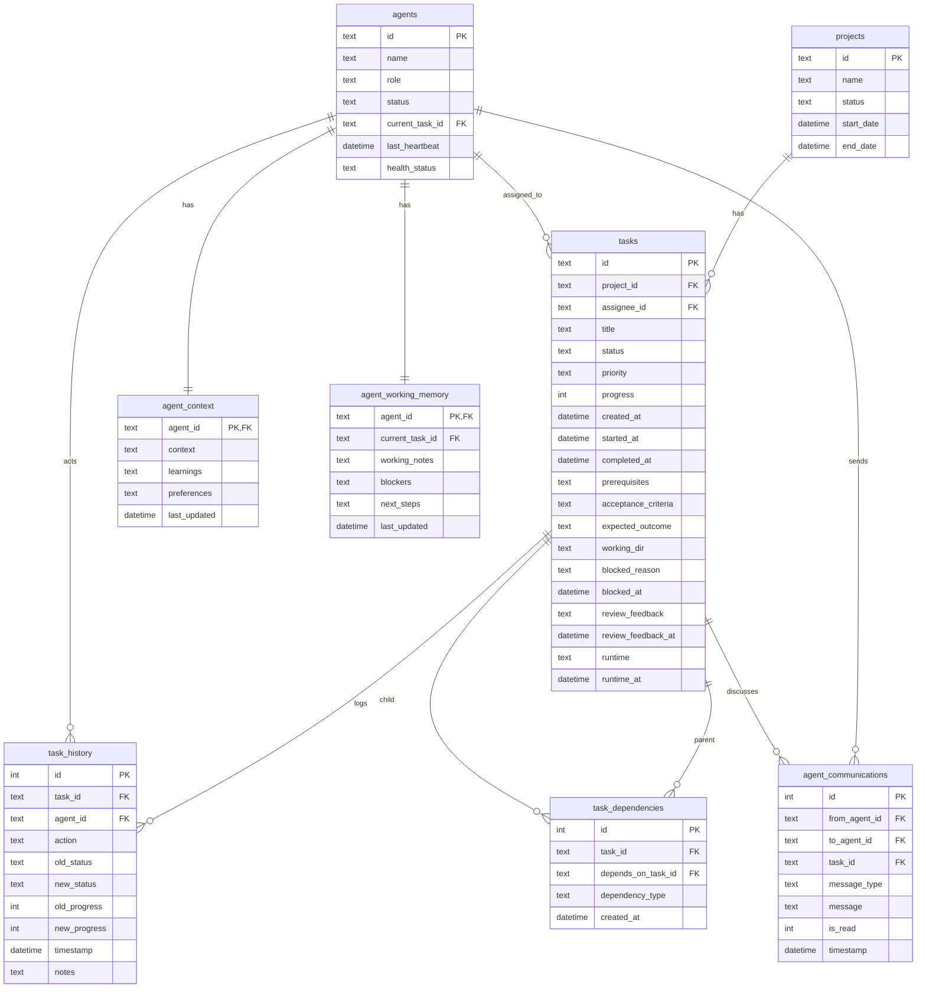

# ERD (team.db)

หมายเหตุ:
- ERD นี้โฟกัสเฉพาะส่วน “AI Team System” หลัก ๆ (ไม่รวม shift swap / orchestrator / notifications ทั้งหมด)
- สถานะสำคัญของ task: `backlog`, `todo`, `in_progress`, `review`, `reviewing`, `done`, `blocked`, `info_needed`

